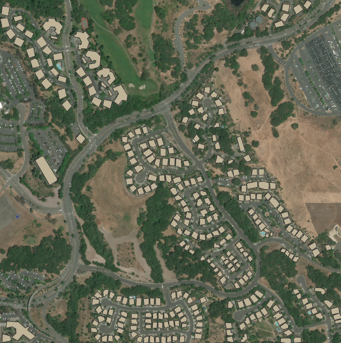
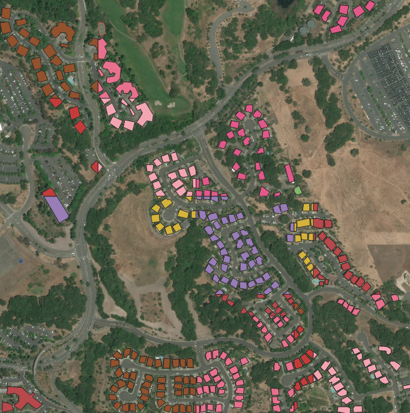

# GeoDataProcessor

[](https://app.codacy.com/gh/homomorfism/GeoDataProcessor?utm_source=github.com&utm_medium=referral&utm_content=homomorfism/GeoDataProcessor&utm_campaign=Badge_Grade_Settings)
[](https://codecov.io/gh/homomorfism/GeoDataProcessor)

## Description

This library aims to help ML engineers to work with large satellite images. GeoDataProcessorv is fast python library
that crops large satellite images files to small tiles for passing it to model. Library takes as an input directory with
geo images and labels (as it shown in example of usage), makes clipping on input data and saves clipped tiles
to `saving_folder/images` and `saving_folder/labels` respectively.

## Example of usage

- examples/preprocess_example.py

```python 
from pathlib import Path
from geodataset.fileutils.parse_directory import create_empty_folder
from geodataset.datasets import GeoImageDataset


def preprocess(images, labels, tile_size, saving_folder):
    dataset = GeoImageDataset(image_dataset=images,
                              shp_dataset=labels)

    dataset.clip_dataset(tile_size, output_directory=saving_folder)


def main():
    images = Path("data/images")
    labels = Path("data/labels")
    saving_folder = Path("buildings_train/")
    create_empty_folder(saving_folder)

    tile_size = 512
    preprocess(images, labels, tile_size, saving_folder)


if __name__ == '__main__':
    main()

```

## Examples of input and output

Input image with labels            |  Cropped image with labels
:-------------------------:|:-------------------------:
|   |   |
|  |  |

## Installing

- locally:
  - ```git clone https://github.com/homomorfism/GeoDataProcessor```
  - ```cd GeoDataProcessor```
  - ```pip install .```
- from pypl
  - ```pip install GeoDataProcessor==1.0```

## Run tests

Run `$ pytest`

## References

Data of segmentation of buildings were taken
from [aeronet tutorials](https://github.com/aeronetlab/aeronet-tutorials/releases/download/0.0.1/buildings_segmentation.zip)
