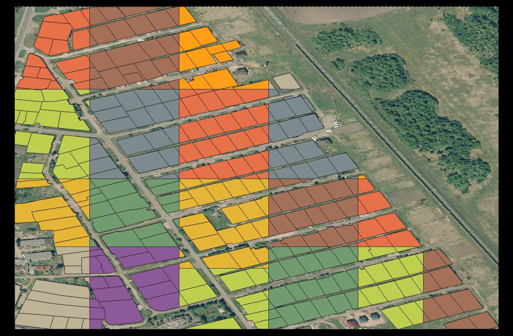

# GeoDataProcessor

## Description

Fast library that crops large satellite images files to small tiles for passing it to model. Library takes as an input
directory with geo images and labels (as it shown in example of usage), makes clipping on input data and saves clipped
tiles to `saving_folder/images` and `saving_folder/labels` respectively.

## Example of usage

- examples/preprocess_example.py

```python
from pathlib import Path
from geodataset.datasets import GeoImageDataset


def preprocess(images, labels, tile_size, saving_folder):
    dataset = GeoImageDataset(image_dataset=images,
                              shp_dataset=labels)

    dataset.clip_dataset(tile_size, output_directory=saving_folder)


def main():
    images = Path("data/images")
    labels = Path("data/labels")
    saving_folder = Path("cleaned/")
    saving_folder.mkdir()

    tile_size = 1024
    preprocess(images, labels, tile_size, saving_folder)


if __name__ == '__main__':
    main()
```

## Examples of input and output

Input image with labels            |  Cropped image with labels
:-------------------------:|:-------------------------:
  |  

## Installing

- locally:
    - ```git clone https://github.com/homomorfism/GeoDataProcessor```
    - ```cd GeoDataProcessor```
    - ```pip install .```
- from pypl
    - to be added

## Run tests

```bash
pytest
```